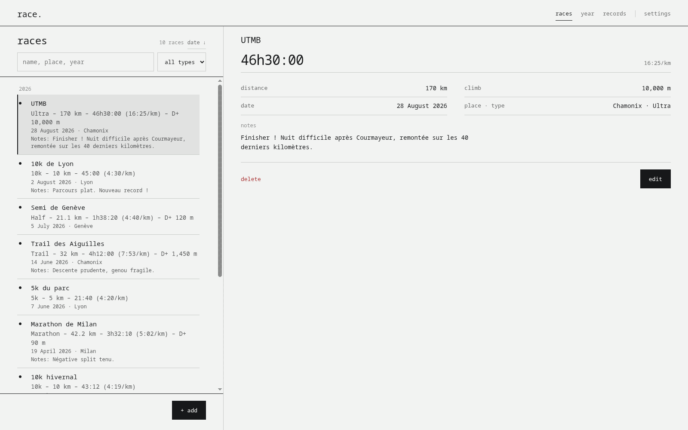
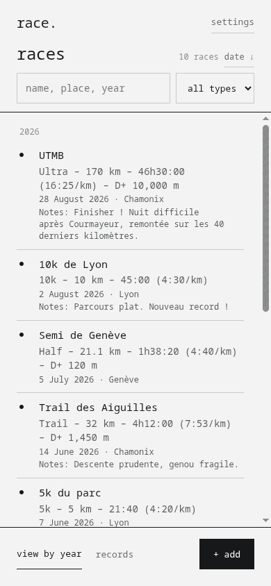
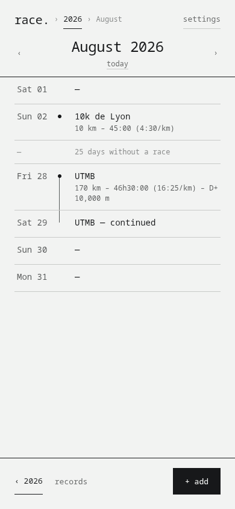
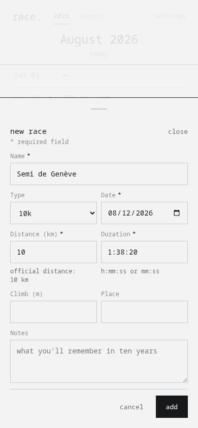
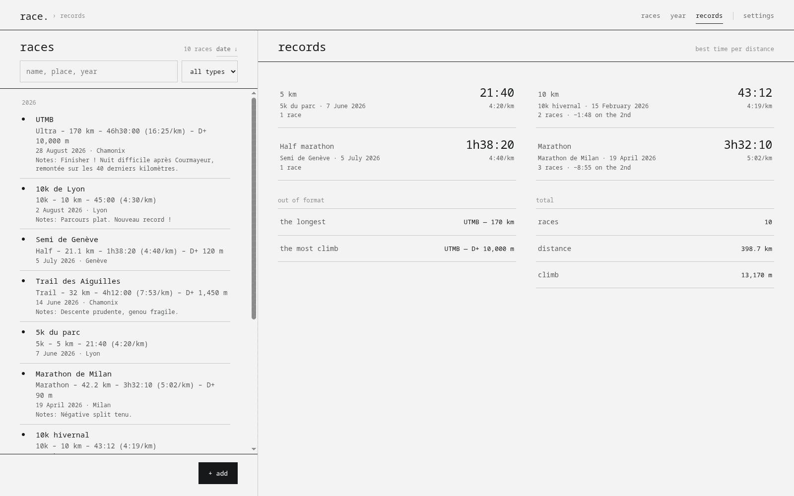
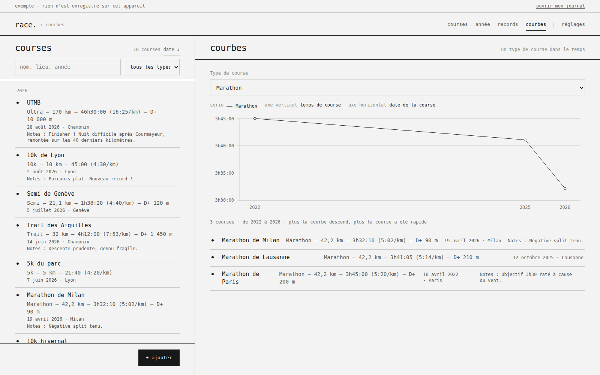

# race.


**All your races. One line each.**

race. answers a single question: *what have I run?* No training plan, no
leaderboard, no advice. You write the race down, and it is still readable in ten
years.

No account, no network, no paid tier. Everything lives in your browser's local
storage, and the only exchange format is a `race.json` file that you export and
import yourself.

<picture>
  <source
    media="(prefers-color-scheme: dark)"
    srcset="docs/screenshots/app-desktop-dark.png">
  
</picture>

---

## Contents

- [What it is](#what-it-is)
- [What it is not](#what-it-is-not)
- [Screens](#screens)
- [Getting started](#getting-started)
- [Your data](#your-data)
- [Architecture](#architecture)
- [Design system](#design-system)
- [Browser support](#browser-support)
- [Contributing](#contributing)
- [Licence](#licence)

## What it is

|  |  |
|---|---|
| **Unit** | one race — name, date, distance, duration; place, climb and notes optional |
| **Views** | List (default) · Year · Month · Records · Curves |
| **Vocabulary** | `●` a race took place · `·` nothing that month · a vertical line carries a race across several days |
| **Data** | `localStorage`, `schemaVersion` 1, JSON export and import |
| **Languages** | French, English, or the one your system asks for |
| **Install** | progressive web app, works offline once loaded |
| **Licence** | AGPL-3.0-or-later |

Three layouts, one behaviour. On a phone the app is a single column with its
actions in reach of the thumb. On a wide screen the list stays on the left and
the current view — race card, year, month, records, curves — occupies the
right, so
moving from one race to the next never hides the others.

## What it is not

- no GPS tracking, no watch to connect
- no badges, no streak to keep alive
- no sharing, no leaderboard
- no notifications, no cookies, no telemetry
- no prediction, no goal to hit: Curves shows what was run, it does not advise

A feature that does not serve *what have I run?* is not added.

## Screens

| List | Month | New race |
|---|---|---|
|  |  |  |

Records — best time per official distance, the gap to the second, and the
totals:



Curves — one race type over time. Official distances are plotted as finish time,
formats with no fixed distance as pace. The axis is not flipped: a faster race
sits lower, and the chart says so rather than miming it.



## Getting started

Node 20.19+ or 22.12+ is required (Vite 8).

```bash
git clone https://github.com/trced/race.git
cd race
npm install
npm run dev        # http://localhost:5173
```

| command | effect |
|---|---|
| `npm run dev` | development server |
| `npm run build` | typecheck, then a production build in `dist/` |
| `npm run preview` | serve the production build |
| `npm run typecheck` | `tsc --noEmit` |
| `npm test` | test suite (Vitest) |
| `npm run test:watch` | tests in watch mode |
| `npm run icons` | regenerate the PWA icons in `public/` |

`/app?demo=1` opens the app filled with a sample logbook, writing nothing to
the device.

## Your data

There is no server to send anything to. The service worker precaches the app on
download; after that no network request is made in use. No cookies, so no
consent banner.

Everything sits under a single `localStorage` key, `race.v1`, in exactly the
shape of the export file — what the app reads is what comes out of it, so there
is no boundary where the two can drift apart:

```json
{
  "schemaVersion": 1,
  "data": {
    "races": [
      {
        "id": "sample-1",
        "type": "ultra",
        "name": "UTMB",
        "date": "2026-08-28",
        "distance": 170,
        "duration": "46:30:00",
        "elevationGain": 10000,
        "location": "Chamonix",
        "notes": "Finisher."
      }
    ]
  },
  "settings": {
    "theme": "system",
    "lang": "system",
    "unit": "km",
    "pace": "shown",
    "defaultView": "list"
  }
}
```

Distances are stored in kilometres and durations as `h:mm:ss` or `mm:ss`,
whatever unit you display. A field you have not touched is never rewritten, so
switching to miles and saving does not degrade the value.

Importing offers a choice between merging and replacing, and a malformed race is
dropped on its own rather than failing the whole file.

**Clearing your browser storage erases everything, for good.** Settings →
export, regularly.

## Architecture

```
src/
├── lib/                  pure core, no React and no DOM
│   ├── types.ts          Race, Settings, RaceFile, schemaVersion
│   ├── format.ts         durations, distances, paces, dates (Intl)
│   ├── validate.ts       form validation, returning i18n keys
│   ├── calendar.ts       month building, gaps and continuations
│   ├── records.ts        best times, extremes, totals
│   ├── curves.ts         series per race type, axis scales and ticks
│   ├── io.ts             race.json: read, write, merge
│   └── storage.ts        local persistence
├── i18n/                 fr.ts (reference) + en.ts (typed mirror) + runtime
├── state/store.tsx       single source: races and settings
├── components/           the "famille ." 1.2.0 design system
├── app/                  the app itself — views, sheets, panes
├── site/                 web pages — overview, about, legal
├── data/changelog/       changelog, bilingual
└── styles/               tokens.css, base.css, components.css, app.css, site.css
```

`lib/` knows nothing of React or the DOM: it carries every piece of logic that
could be wrong, and it is tested without a browser.

### Decisions

- **Storage is the export format.** No conversion at the boundary, so no place
  for the two shapes to diverge.
- **Validation returns keys, not sentences.** `app.edit.error.date` is
  translated at display time; the core stays language-independent.
- **`fr.ts` is the reference, `en.ts` a typed mirror.** A missing or extra key
  fails compilation, and tests catch what types cannot — an empty string, a
  dropped placeholder, a missing plural form.
- **Example mode does not duplicate settings.** It replaces the list of races
  only; a theme set from the demo is a real setting, and the personal logbook is
  never touched.
- **Nothing is written on open.** The first write waits for the first change.
- **No hover changes geometry.** State is read, never guessed, and never at the
  cost of the layout moving under the pointer.

## Design system

The implementation follows the "famille ." (*trced*) family, version 1.2.0,
whose reference lives in
[`docs/Design System v1.2.dc.html`](docs/Design%20System%20v1.2.dc.html). The
race. mockups are in [`docs/race.dc.html`](docs/race.dc.html) and
[`docs/RaceApp.dc.html`](docs/RaceApp.dc.html). Where the code and those
documents disagree, the documents are right and the code has a bug.

Tokens live in `src/styles/tokens.css`; a hard-coded value in a component is a
conformance defect. Constraints held:

- system CSS under 8 kB compressed (`tokens` + `base` + `components`, 6.7 kB today)
- no remote fonts, no images in the interface
- one third-party UI dependency, and only one: Recharts draws the Curves view.
  It is loaded on its own, when that view is opened, and it is styled entirely
  from the tokens — no colour, font or radius of its own survives
- 44 × 44 touch targets, 2 px focus ring at 3 px offset, WCAG 2.2 AA
- no drop shadows; the 1 px rule is the only separator
- right angles throughout; state reads, it does not colour

## Browser support

Any evergreen browser that supports `color-mix()`: Chrome and Edge 111,
Firefox 113, Safari 16.4 and later. There is no build-time polyfill and no
transpilation target below that.

## Contributing

Issues and pull requests are welcome. Start with
[CONTRIBUTING.md](CONTRIBUTING.md) — it covers the setup, the conventions, and
the two rules that get pull requests turned down.

Everyone taking part is expected to follow the
[Code of Conduct](CODE_OF_CONDUCT.md). Security reports go through
[SECURITY.md](SECURITY.md), not the public tracker.

## Licence

[AGPL-3.0-or-later](LICENSE). Free and copyleft: any modified version that is
distributed — including one merely exposed over a network — stays free, source
code included.

---

race. 0.1 — one thing. done well.
